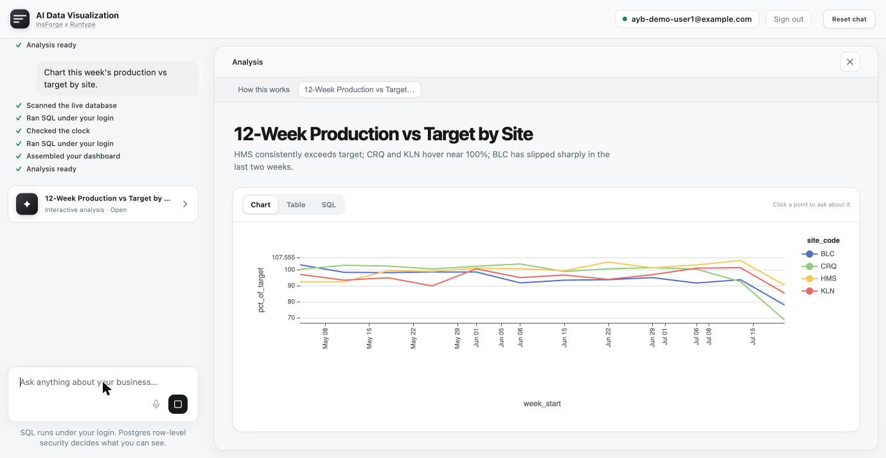
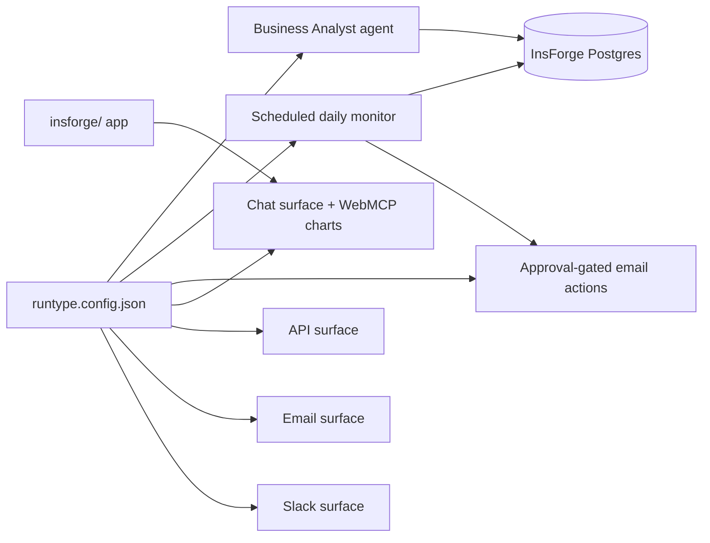

# AI Data Visualization

AI data analyst built with [Runtype](https://runtype.com) 

Input: 

- A Postgres database with business data
- A question about the data

Outputs: 
- A relevant dashboard, table and SQL (generative UI via [Flint](https://microsoft.github.io/flint-chart/#/)) 
- Scheduled reports to track that data over time, via email

Works on:
- Web (streamed, generative UI via [Persona](https://www.persona-chat.dev/))
- Email
- Slack

Uses [Insforge](https://insforge.dev/) for app, database, and auth hosting, including a full multi-tenant agent architecture with user accounts and differing permission levels for the data which the agent respects.

The agent can answer questions with generative UI using Microsoft's [Flint](https://microsoft.github.io/flint-chart/#/). In the web UI, the results are streamed in using [Persona](https://www.persona-chat.dev/). When used in a different surface such as email, charts are generated as images and included inline in the email report by the agent. Scheduled reports are also included.



## Start here: Runtype configuration

The entire product is composed in one file: [**`runtype.config.json`**](./runtype.config.json).

It defines:

- **Two agents** — the conversational **Business Analyst** and the **Daily Business Monitor**
- **Product surfaces** — the chat surface (with WebMCP interactive charts), an API surface, an email surface (mail the analyst, get a report with chart images back), and a Slack surface
- **Email actions** — approval-gated `send_email` with recipients looked up from your own data
- **Scheduling** — the monitor's cron schedule and timezone
- **Integrations and wiring** — the InsForge Postgres tools, chart rendering, per-user records, and an analyst-grounding eval suite

Inspect and validate it locally with the CLI, then restore it into your own Runtype account:

```bash
# validate the config locally (no account needed)
npx @runtypelabs/cli validate-product runtype.config.json

# restore it: open the dashboard template importer pointed at the config
open "https://use.runtype.com/now?templateUrl=https://raw.githubusercontent.com/runtypelabs/ai-data-visualization/main/runtype.config.json"
```

The importer prompts for the template variables (product name, your InsForge base URL, business context, monitor schedule, alert email) and the one pending secret, `INSFORGE_API_KEY`. The same URL works with Runtype's MCP tooling (`create_product_from_example` with a `url`).

The runnable app implementation lives in [`./insforge`](./insforge) — it's the supporting half that serves the web app and hosts the data.

## Architecture



Runtype supplies the intelligence: schema discovery, inspectable text-to-SQL, generated dashboards, actions, monitoring. [InsForge](https://insforge.dev) supplies the backend — Postgres, auth, edge functions serving the web app. Point the template at a different database and the same config becomes an analyst for whatever your data tracks: the agents discover your schema live, nothing is hard-coded.

## Deploy the full demo

**1. The Runtype half** — restore `runtype.config.json` as above.

**2. The InsForge half** — seed the sample dataset and deploy the web app:

```bash
export INSFORGE_BASE_URL=https://<your-app>.insforge.app INSFORGE_ADMIN_KEY=<key>
node scripts/seed-sample-data.mjs        # optional sample dataset (skip for your own data)
node scripts/deploy-flint-render.mjs     # chart-image renderer for email/scheduled surfaces
RUNTYPE_CLIENT_TOKEN=ct_live_... INSFORGE_ANON_KEY=anon_... node scripts/deploy-shell.mjs
```

Your analyst is live at `https://<your-app>.insforge.app/functions/ai-data-visualization`. Full setup — including end-user auth with per-user row-level security — is documented in [`insforge/README.md`](./insforge/README.md). Working with a coding agent? [`SKILL.md`](./SKILL.md) is an agent-consumable install guide for the whole thing.

## License

Apache 2.0 — see [LICENSE](./LICENSE).
